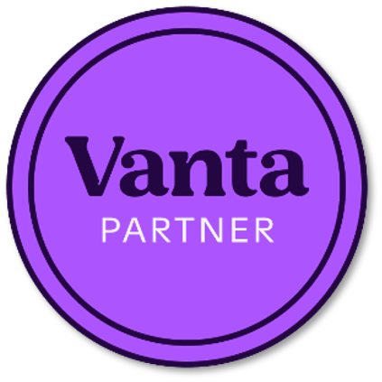
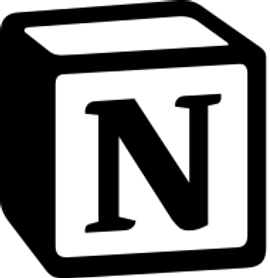

# GDPR, ISO 27001 and AI Act template kit

The templates on this page are made by the people of ICT Institute. We use these templates in our training sessions and our advisory work. We decided to make our templates available to anyone with hardly any restrictions. 

<table>
  <tr>
    <td width="70" valign="middle"></td>
    <td valign="middle">Check out how to implement ISO 27001 with this ISMS template kit on our YouTube channel <a href="https://www.youtube.com/@sieuwertexplains">@SieuwertExplains</a>.</td>
  </tr>
  <tr>
    <td width="70" valign="middle"></td>
    <td valign="middle">See <a href="https://ictinstitute.nl/free-templates/">our website</a> for more in-depth articles and more detiled guidance.</td>
  </tr>
  <tr>
    <td width="70" valign="middle"></td>
    <td valign="middle">ICT Institute has joined the Vanta partner programme to combine hands-on ISMS support with a compliance platform to reduces manual evidence collection. <a href="https://ictinstitute.nl/ict-institute-vanta-partner/">Read the post</a>.</td>
  </tr>
  <tr>
    <td width="70" valign="middle"></td>
    <td valign="middle">ICT Institute provides a free Notion ISMS template to help organizations set up a core ISO 27001 risk management process in a practical, collaborative workspace. <a href="https://ictinstitute.nl/using-notion-for-your-isms/">Read the post</a>.</td>
  </tr>
</table>

## List of templates

### AI & AI Act

 - [**AI policy template.docx**](https://raw.githubusercontent.com/swzaken/freetemplates/main/AI%20%26%20AI%20Act/AI%20policy%20template.docx) -  A comprehensive AI policy template that outlines principles and rules for acceptable use of AI systems. It covers acceptable use principles, privacy aspects and AI Act compliance, AI and coding guidelines, approved AI services, training and awareness requirements, and includes guidelines for assessing AI use.
 - [**FRIA assessment template.docx**](https://raw.githubusercontent.com/swzaken/freetemplates/main/AI%20%26%20AI%20Act/FRIA%20assessment%20template.docx) - A Fundamental Rights Impact Assessment (FRIA) template to identify, assess, and document potential impacts of AI systems on fundamental rights in line with AI Act requirements. Includes a 5000-words worked example.
 - [**ISO 42001 audit report template.docx**](https://raw.githubusercontent.com/swzaken/freetemplates/main/AI%20%26%20AI%20Act/ISO%2042001%20audit%20report%20template.docx) - Example internal audit report template for an AI Management System (AIMS) under ISO/IEC 42001, including audit methodology/process, documents/evidence, and control explanations.

### GDPR

- [**GDPR-Data-Processing-Agreement.docx**](https://raw.githubusercontent.com/swzaken/freetemplates/main/GDPR/Data-Processing-Agreement/GDPR-Data-Processing-Agreement.docx) - A GDPR data processing agreement template that defines roles, responsibilities, and safeguards for processing personal data, including data subject rights, security measures, sub-processor conditions, international transfers, and audit rights.
- [**DPIA.docx**](https://raw.githubusercontent.com/swzaken/freetemplates/main/GDPR/DPIA/DPIA.docx) - A Data Protection Impact Assessment template for identifying, assessing, and documenting privacy risks and mitigation measures.
- [**GDPR-Joint-Controllership-Agreement.docx**](https://raw.githubusercontent.com/swzaken/freetemplates/main/GDPR/GDPR-Joint-Controllership-Agreement/GDPR-Joint-Controllership-Agreement.docx) - Template for a joint controllership agreement under GDPR, clarifying roles, responsibilities, and cooperation between joint controllers.
- [**Project plan.docx**](https://raw.githubusercontent.com/swzaken/freetemplates/main/GDPR/Project%20plan/Project%20plan.docx) - A GDPR-focused project plan template for planning and managing GDPR implementation activities and milestones.
- [**Register of processing activities.xlsx**](https://raw.githubusercontent.com/swzaken/freetemplates/main/GDPR/Register%20of%20processing%20activities.xlsx) - Template register for recording personal data processing activities in line with GDPR Article 30 requirements.
- [**Register van verwerkingsactiviteiten.xlsx**](https://raw.githubusercontent.com/swzaken/freetemplates/main/GDPR/Register%20verwerkingsactiviteiten.xlsx) - Template register voor het noteren van verwerkingen van persoonsgegevens.
### ISO 27001

- [**Project plan.docx**](https://raw.githubusercontent.com/swzaken/freetemplates/main/ISO27001/Project%20plan/Template%20Project%20plan.docx) - A project plan template for planning and managing information security or ISO 27001 implementation projects, including activities, timelines, and deliverables.
- [**Project plan NL.docx**](https://raw.githubusercontent.com/swzaken/freetemplates/094ccda856eba792c32ade08444af003797009ca/ISO27001/Project%20plan/Template%20Projectplan%20NL.docx) - Een project plan template voor het plannen en managen van informatiebeveiliging of ISO 27001 implementatie projecten, inclusief activiteiten, tijdlijnen en resultaten.
- [**Context-Assets-Risk-register-SoA.xlsx**](https://raw.githubusercontent.com/swzaken/freetemplates/main/ISO27001/Assets-risks-applicability/Context-Assets-Risk-register-SoA.xlsx) - Template for maintaining an asset inventory and associated information security risks including a register for statement of applicability in line with ISO 27001 risk management requirements.
- [**Context-Assets-Risico's-register-VvT NL.xlsx**](https://raw.githubusercontent.com/swzaken/freetemplates/main/ISO27001/Assets-risks-applicability/Context-Assets-Risico's-register-VvT%20NL.xlsx) - Template voor het bijhouden van assets, bijbehorende risico's evenals een register Verklaring van Toepasselijkheid van ISO 27001.
- [**Authorisation matrix.xlsx**](https://raw.githubusercontent.com/swzaken/freetemplates/main/ISO27001/Authorisation%20matrix/Authorisation%20matrix.xlsx) - Authorisation matrix template mapping users, roles, and access rights to systems and information.
- [**Authorisatie matrix en VOG-register NL.xlsx**](https://raw.githubusercontent.com/swzaken/freetemplates/main/ISO27001/Authorisation%20matrix/Authorisatie%20matrix%20en%20VOG-register%20NL.xlsx) - Authorisatie matrix template voor het bijhouden van werknemers, rollen, en toegang tot systemen en informatie, inclusief een overzicht van VOG's.
- [**Business Continuity Management.docx**](https://raw.githubusercontent.com/swzaken/freetemplates/094ccda856eba792c32ade08444af003797009ca/ISO27001/Business%20Continuity%20Management/Business%20Continuity%20Management.docx) - Business continuity management template describing continuity plans, responsibilities, and recovery strategies.
- [**Bedrijfscontinuïteit plan NL.docx**](https://raw.githubusercontent.com/swzaken/freetemplates/094ccda856eba792c32ade08444af003797009ca/ISO27001/Business%20Continuity%20Management/Bedrijfscontinu%C3%AFteit%20plan%20NL.docx) - Template voor het Bedrijfscontinuïteits plan met plannen, verantwoordelijkheden en herstel strategieën.
- [**Incidents-Data-breaches-Nonconformities.xlsx**](https://raw.githubusercontent.com/swzaken/freetemplates/main/ISO27001/Incidents-data-breaches-nonconformities/Incidents-Data-breaches-Nonconformities.xlsx) - Log template for recording information security incidents, data breaches, and nonconformities, including impact and corrective actions.
- [**Incidenten-Databreaches-afwijkingen NL.xlsx**](https://raw.githubusercontent.com/swzaken/freetemplates/main/ISO27001/Incidents-data-breaches-nonconformities/Incidenten-Databreaches-Afwijkingen%20NL.xlsx) - Template voor het vastleggen van informatiebeveiligings incidenten, datalekken en afwijkingen inclusief impact en acties.
- [**Information security policy.docx**](https://raw.githubusercontent.com/swzaken/freetemplates/main/ISO27001/Information%20security%20policy/Information%20security%20policy.docx) - High-level information security policy template describing objectives, principles, and management commitment.
- [**Informatiebeveiligingsbeleid NL.docx**](https://raw.githubusercontent.com/swzaken/freetemplates/main/ISO27001/Information%20security%20policy/Informatiebeveiligingsbeleid%20NL.docx) - Template voor informatiebeveiligingsbeleid.
- [**Information security procedures.docx**](https://raw.githubusercontent.com/swzaken/freetemplates/main/ISO27001/Information%20security%20procedures/Information%20security%20procedures.docx) - Template for detailed information security procedures supporting the ISO 27001 management system.
- [**Informatiebeveiligingsprocedures NL.docx**](https://raw.githubusercontent.com/swzaken/freetemplates/main/ISO27001/Information%20security%20procedures/Informatiebeveiligingsprocedures%20NL.docx) - Template voor gedetailleerd informatiebeveiligingsprocedures die het ISO 27001 management systeem ondersteunen.
- [**Information security rules.docx**](https://raw.githubusercontent.com/swzaken/freetemplates/main/ISO27001/Information%20security%20rules/Information%20security%20rules.docx) - Information security rules for staff, describing acceptable use and behavioral requirements.
- [**Personeelsregels voor informatiebeveiliging NL.docx**](https://raw.githubusercontent.com/swzaken/freetemplates/main/ISO27001/Information%20security%20rules/Personeelsregels%20voor%20informatiebeveiliging%20NL.docx) - Personeelsregels voor informatiebeveiliging, beschrijft onder andere acceptabel gebruik en gedragsregels.
- [**Register stakeholders and communication.xlsx**](https://raw.githubusercontent.com/swzaken/freetemplates/main/ISO27001/Register%20stakeholders%20and%20communication/Register%20stakeholders%20and%20communication.xlsx) - Register of interested parties and communication activities related to the information security management system.
- [**Register-belanghebbenden-en-communicatie NL.xlsx**](https://raw.githubusercontent.com/swzaken/freetemplates/main/ISO27001/Register%20stakeholders%20and%20communication/Register-belanghebbenden-en-communicatie%20NL.xlsx) - Register van belanghebbende en communicatie gerelateerd aan informatiebeveiliging.
- [**Summary of laws and regulations.docx**](https://raw.githubusercontent.com/swzaken/freetemplates/main/ISO27001/Summary%20of%20laws%20and%20regulations/Summary%20of%20laws%20and%20regulations.docx) - Summary template for applicable laws, regulations, and contractual requirements affecting information security.
- [**Overzicht wet-en regelgeving NL.docx**](https://raw.githubusercontent.com/swzaken/freetemplates/main/ISO27001/Summary%20of%20laws%20and%20regulations/Overzicht%20wet-%20en%20regelgeving%20NL.docx) - Template voor een overzicht van wet-en regelgeving gerelateerd aan informatiebeveiliging.
- [**Supplier register.xlsx**](https://raw.githubusercontent.com/swzaken/freetemplates/main/ISO27001/Supplier%20register/Supplier%20register.xlsx) - An ISO 27001 suppliers register template to record and assess suppliers, including the documented and practical requirements and their assessments, supporting Annex A supplier relationship requirements.
- [**Leveranciersoverzicht en beoordeling NL.xlsx**](https://raw.githubusercontent.com/swzaken/freetemplates/main/ISO27001/Supplier%20register/Leveranciersoverzicht%20en%20beoordeling%20NL.xlsx) - Een template voor een register van leveranciers, ter ondersteuning van Annex A eisen aan leveranciers.
- [**Management review report.docx**](https://raw.githubusercontent.com/swzaken/freetemplates/main/ISO27001/managementreview/Management%20review%20report.docx) - An ISO 27001 mangement review report template to prepare for the mangement review and cover all the important aspects during the management review.
- [**Managementreview verslag NL.docx**](https://raw.githubusercontent.com/swzaken/freetemplates/d6de50bc06523e10bc8fe678f84d92810d61f8be/ISO27001/managementreview/Managementreview%20verslag%20NL.docx) - Een template voor het voorbereiden en uitvoeren van een management review volgens ISO 27001.
### Extra

- [**How_to_implement_your_ISMS_in_Notion.pdf**](https://raw.githubusercontent.com/swzaken/freetemplates/main/extra/How_to_implement_your_ISMS_in_Notion.pdf) - A guide for implementing your ISMS in Notion, providing practical instructions and best practices for setting up and managing your ISMS documentation and processes using Notion.

## License
Templates are provided under the Creative Commons license Attribution license. You can do the following with the templates:

- Share. You can share the templates and any documents made with these templates freely, with any one that you want to share it with.
- Adapt. You can make new documents based on the templates, make changes, add elements or delete elements as much as you want. You can even do this in commercial organisations of for commercial purposes.

Note that the use of these templates is of course at your own risk. We made an effort to include all required items in the template, but when we use these templates we change them to fit the intended use. Note also that the ISO 27001 norm is copyright protected. You must buy a copy of the norm before you can use it.

